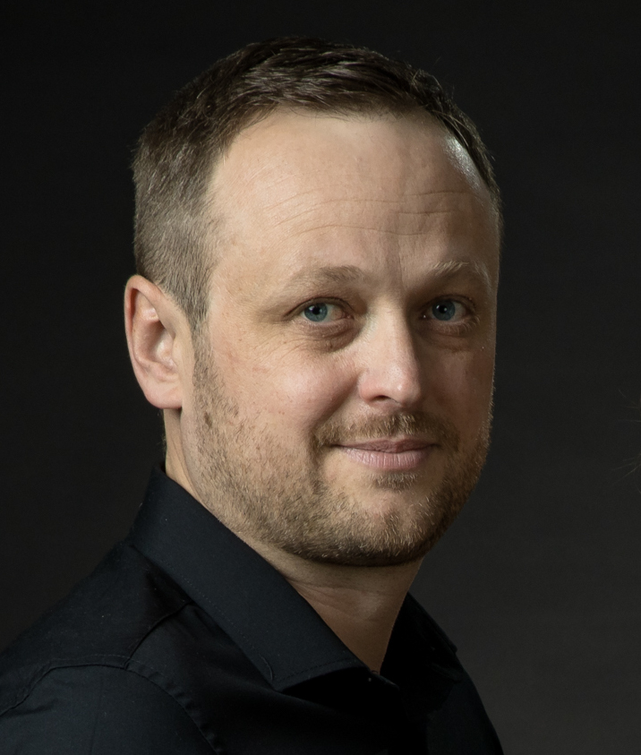

# Working Group Members

## Cyril Richard

  

**Affiliation:** CNRS (French National Centre for Scientific Research), Laboratoire Interdisciplinaire Carnot de Bourgogne, Dijon, France  
**Role:** Research Engineer, Molecular Spectroscopy & Astrophysical Databases

**Research interests:**

- Molecular spectroscopy and spectroscopic databases
- Astrophysical molecules and astrochemistry
- High-resolution molecular physics
- Laboratory spectroscopy for astrophysical applications
- Astronomical image processing and photometry

**Expertise & data areas:**

- Development and curation of molecular spectroscopic databases (CaSDa24)
- Theoretical and experimental molecular spectroscopy
- Astronomical image processing software development (Siril)
- Scientific outreach and education in astronomy

**Web links:**

- [Personal page](https://icb.cnrs.fr/equipe/cyril-richard/)
- [Siril project](https://siril.org/)
- [GitLab profile](https://gitlab.com/free-astro/siril)
- ORCID: _[https://orcid.org/0000-0002-8882-8448]_

**Contact for questions about:**

- Molecular spectroscopic data for astrophysical applications
- Integration of spectroscopic databases with observational data
- Laboratory spectroscopy for space missions

---
